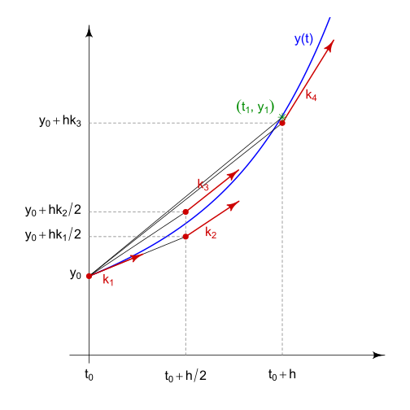

---
jupytext:
  cell_metadata_filter: -all
  formats: md:myst
  text_representation:
    extension: .md
    format_name: myst
    format_version: 0.13
    jupytext_version: 1.11.5
kernelspec:
  display_name: Python 3
  language: python
  name: python3
markdown_extensions:
      - admonition
---

# Clase Demostrativa

## Técnicas de simulación de sistemas dinámicos: Runge Kutta con paso adaptivo.

``````{admonition} Qué vamos a ver en esta clase?
:class: seealso
Vamos a aprender formas analíticas de resolver sistemas de ecuaciones en sistemas dinámicos.
``````

``````{admonition} Objetivos
:class: tip
Conocer el método de Runge Kutta para resolver ecuaciones diferenciales en sistemas dinámicos.
``````

### Quick recap

Vamos a recordar algunas definiciones que serán útiles en esta clase:

``````{admonition} Sistemas No lineales
:class: note

Son sistemas que no pueden ser descritos por sistemas de ecuaciones lineales. Para sistemas no lineales, no siempre se puede encontrar una solución explicita a un problema con cualquier condición inicial. Es por eso que encontrar una solución analítica a estos problemas no es posible.
``````

``````{admonition} Linearidad
:class: note

Para que una función satisfaga el principio de linealidad debe tener las siguientes propiedades:
 * Aditividad: $\textstyle f(x + y) = f(x) + f(y)$
 * Homogeneidad: $f(\alpha x) = \alpha f(x)$

Un sistema descrito por ecuaciones diferenciales no es *lineal* si no es un sistema de ecuaciones que cumplan los requisitos previos.
``````


``````{admonition} Sistema dinámico
:class: note

Son formas de describir el *paso del tiempo* en todos los puntos del espacio $\mathcal S$, que puede ser por ejemplo el espacio de estados de un sistema físico.
``````


### Métodos de Runge Kutta

Estos son una familia de métodos *iterativos* en análisis numérico que nos permiten resolver de forma numérica ecuaciones diferenciales. A pesar de su simplicidad, estos métodos son muy precisos y se ha demostrado que se tienen un buen comportamiento en muchos problemas.

La idea general en todos estos métodos es aproximar el resultado de una función/curva desconocida conociendo las condiciones iniciales. Empecemos con el método más sencillo de resolver ecuaciones diferenciales, conocido como el método de Euler.

#### Método de Euler

La idea del método de Euler es simple. Cuando la forma específica del resultado no es conocida, su condición inicial si lo es ($A_0$). Así, la pendiente de la curva puede ser calculada en el punto $A_0$ de la ecuación diferencial, y de esta manera su línea tangente. Si nos movemos un *paso* por esta tangente podemos encontrar un punto $A_1$ desde donde volvemos a calcular la pendiente.

Notese que la precisión de este método depende del tamaño de este paso.


Matemáticamente, dados las condiciones iniciales $t_0$ y $x(t_0)$ y conociendo que la derivada de $x$ es una función de $t$ y $x$, o $\frac{dx}{dt} = f(t, x(t))$, este método comienza con $x_0 = x(t_0)$ y un tamaño del paso $\Delta t$. Se puede definir también que $t_k = t_0 + k \Delta t$ o equivalentemente $t_{k+1} = t_k + \Delta t $, donde $k$ es el número del paso.  Así, para un paso se tiene que:

```{math}
:label: eulereq
x_{k+1} = x_k + \Delta t f(t_k, x_k)
```

que es el valor aproximado de la solución de la ecuación al tiempo $t_n$.

````{prf:example}
:label: euler-example

Consideremos la siguiente ecuación diferencial:

$$ \frac{dy}{dx} = ( x + y ) $$

y las condiciones iniciales $x_0 = 0$, $y_0 = 1$, $\Delta t = 0.025$. Entonces:

$$f(x, y(x)) = x + y$$

$$f(x_0, y(x_0)) = f(0, 1) = 0 + 1 = 1$$

$$y_1 = y_0 + \Delta t f( x_0, y_0) = 1 + 0.025 (1) = 2.025$$

````

Veamos este ejemplo gráficamente:
[](https://colab.research.google.com/github/alefisico/FISD803-EPN/blob/main/FISD803-EPN/classes/clase1.ipynb)

``````{seealso}
Hay muchos recursos online sobre este método, aquí unas sugerencias:
 * [Euler method - Jeffrey Chasnov](https://www.youtube.com/watch?v=WMQ2Cac4sqw)
``````

#### Método de Runge Kutta

Este es el método más utilizado en resolver ecuaciones diferenciales. Existen métodos más sofisticados pero Runge Kutta sigue siendo el método general. En esta parte vamos a describir el método de cuarto orden (RK4) porque vamos a calcular *cuatro* pendientes ($m_k, n_k, p_k, q_k$) y sumarlas con un promedio ponderado para obtener el siguiente paso, así:

```{math}
:label: rungekutta1
x_{k+1} = x_k + \left( \frac{m_k + 2n_k + 2p_k + q_k}{6} \right) \Delta t
```
con $t_{k+1} = t_k + \Delta t$. Cada pendiente se obtiene de esta manera:

```{math}
:label: rungekutta2
m_k = f(t_k, x_k) \; \text{(método de Euler)}
```
```{math}
:label: rungekutta3
n_k = f(t_k + \frac{\Delta t}{2}, x_k + m_k \frac{\Delta t}{2})
```
```{math}
:label: rungekutta4
p_k = f(t_k + \frac{\Delta t}{2}, x_k + n_k \frac{\Delta t}{2})
```
```{math}
:label: rungekutta5
q_k = f(t_{k+1}, x_k + p_k \Delta t)$$
```

Gráficamente podemos observar: (_Nota: Aqui $x$ se denota como $y$_)
 


 ````{prf:example}
 :label: euler-example

Usemos el mismo ejemplo anterior para ver como se calcula el método de Runge Kutta:

 $$f(x, y(x)) = x + y$$

 $$m_k = f(x_0, y(x_0)) = f(0, 1) = 0 + 1 = 1$$

 $$n_k = f(y_0 + \frac{\Delta t}{2}, x_0 + m_k \frac{\Delta t}{2}) = f( 1 + 0.025/2, 0 + 1(0.025/2) ) = f (1.0125, 0.0125) = 1.0125 + 0.0125 = 1.025$$

$$p_k = f(y_0 + \frac{\Delta t}{2}, x_0 + n_k \frac{\Delta t}{2}) = f(1.0125, 0 + 1.025(0.0125)) = 1.02531$$

$$q_k = f(y_{1}, x_0 + p_k \Delta t) = f(y_{0}+ \Ðelta t, x_0 + p_k \Delta t) = f(1.025, 1.02531(0.025)) = 1.0506$$

Finalmente:

$$x_{1} = x_0 + \left( \frac{m_k + 2n_k + 2p_k + q_k}{6} \right) \Delta t = 0 + \left( \frac{1 + 2(1.025) + 2(1.02531) + 1.0506}{6} \right) 0.025 = 0.02563$$

 ````
 Veamos este ejemplo gráficamente:
 [](https://colab.research.google.com/github/alefisico/FISD803-EPN/blob/main/FISD803-EPN/classes/clase1.ipynb)

#### Método de Runge Kutta con paso adaptivo


```{note}
My directive content
```
